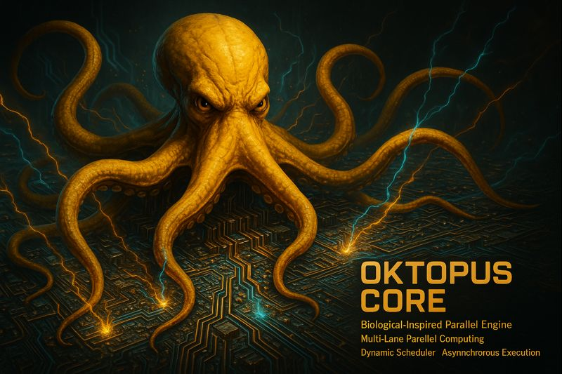

<p align="center">
  
</p>
<p align="center">
  
</p>
<h1 align="center">Oktopus Core™</h1>

<p align="center">
  <strong>Biological-Inspired Parallel Architecture • Multi-Lane Computing • Asynchronous Engine</strong>
</p>

<p align="center">
  Built by <strong>OktoSeek AI</strong> for the <strong>OktoSeek ecosystem</strong>
</p>

<p align="center">
  <a href="https://www.oktoseek.com/">OktoSeek Homepage</a> •
  <a href="https://github.com/oktoseek/oktoengine">OktoEngine</a> •
  <a href="https://x.com/oktoseek">Twitter</a> •
  <a href="https://www.youtube.com/@Oktoseek">YouTube</a>
</p>

---

## Table of Contents

1. [What is Oktopus Core?](#-what-is-oktopus-core)
2. [Biological Inspiration](#-biological-inspiration)
3. [Architecture Overview](#-architecture-overview)
4. [How It Works](#-how-it-works)
5. [Key Benefits](#-key-benefits)
6. [Usage Examples](#-usage-examples)
7. [Technical Overview](#-technical-overview)
8. [Roadmap](#-roadmap)
9. [FAQ](#-frequently-asked-questions-faq)
10. [License](#-license)

---

## 🚀 What is Oktopus Core?

**Oktopus Core™** is a **proprietary parallel computing architecture** inspired by the **octopus**—an animal with a unique neural architecture featuring distributed intelligence.

This biological inspiration enables **massive parallelism** through **multi-lane computing** for AI training and inference.

### Key Highlights

| | |
|---|---|
| **Biological Design** | Inspired by octopus neural architecture |
| **Multi-Lane Parallelism** | Multiple parallel compute lanes |
| **Dynamic Scheduler** | Intelligent work distribution |
| **Asynchronous Engine** | Overlapping operations for maximum efficiency |
| **Production Ready** | Powers OktoEngine training |

---

## 🐙 Biological Inspiration

### The Real Octopus

**Octopuses** have a unique neural architecture:
- **1 Central Brain**: Controls complex decisions and coordination
- **8 Mini-Brains (Tentacles)**: Each tentacle has its own neurons, can act semi-independently
- **Advantage**: Natural parallelism—tentacles can do different things simultaneously

### Oktopus Core™ Implementation

**Oktopus Core™** mimics this architecture:
- **1 Coordinator (Central Brain)**: Coordinates operations, synchronizes parallel lanes
- **Multiple Functional Lanes**: Each specialized in different operation types
- **Advantage**: GPU never idle—multiple operations run simultaneously

---

## 🏗️ Architecture Overview

### High-Level Design

Oktopus Core™ utilizes a **multi-lane parallel architecture** where different types of operations are distributed across specialized compute lanes, all coordinated by a central scheduler.

### Key Concepts

- **Parallel Compute Lanes**: Specialized lanes for different operation types
- **Dynamic Scheduler**: Intelligently distributes work across available lanes
- **Asynchronous Engine**: Operations overlap for maximum GPU utilization
- **GPU-Resident Optimizations**: All operations stay on GPU, minimizing transfers

### How It Works

```
Traditional (Sequential):
  Operation 1 → wait → Operation 2 → wait → Operation 3
  GPU idle between operations! ❌

Oktopus Core™ (Parallel):
  Lane 1: Operation 1 ─┐
  Lane 2: Operation 2 ─┼─→ All run simultaneously
  Lane 3: Operation 3 ─┘
  GPU always busy! ✅
```

---

## 🔄 How It Works

### 1. Intelligent Work Distribution

For large operations, work is **intelligently distributed** across parallel lanes:

```
Large Operation → Dynamic Partitioning
               ↓
      Multiple Parallel Lanes
               ↓
         Final Aggregation
```

### 2. Asynchronous Pipeline

Forward and backward passes **overlap** automatically:

```
Batch N:   Forward Pass (Lane Group 1)
Batch N-1: Backward Pass (Lane Group 2)
           ↓
    Both run simultaneously!
```

### 3. Dynamic Scheduling

The scheduler **dynamically assigns** operations to available lanes based on:
- Operation type
- Resource availability
- Priority and dependencies

---

## ✨ Key Benefits

### 1. Maximum GPU Utilization

GPU is **always busy**, with minimal idle time between operations.

### 2. High Throughput

**Significantly faster** training compared to sequential approaches, achieving **>10× improvement** in many workloads.

### 3. Intelligent Parallelism

**Dynamic scheduling** ensures optimal resource utilization across all parallel lanes.

### 4. Asynchronous Operations

Operations **overlap automatically**, maximizing efficiency without manual optimization.

### 5. GPU-Resident Design

All operations are **designed to stay on GPU**, minimizing CPU-GPU transfers.

### 6. Biological Inspiration

Inspired by **octopus neural architecture** for natural, efficient parallelism.

---

## 💻 Usage Examples

### Automatic Activation

```python
# Oktopus Core™ activates automatically in OktoEngine
# No manual configuration needed!

from oktoengine import train

# Training automatically uses Oktopus Core™
train(config="train.okt")
# → Multi-lane parallelism active
# → Maximum GPU utilization
# → Optimal performance
```

### Seamless Integration

```python
# Oktopus Core™ works transparently
# All operations benefit from parallel architecture
# No code changes needed
```

---

## 📄 Technical Overview

### Abstract

Oktopus Core™ is a proprietary parallel computing architecture inspired by the octopus—an animal with distributed neural intelligence. This biological inspiration enables **massive parallelism** through **multi-lane computing**, achieving **>10× faster** training compared to sequential approaches.

### Key Innovations

1. **Multi-Lane Architecture**: Specialized parallel compute lanes for different operations
2. **Dynamic Scheduler**: Intelligent work distribution across available lanes
3. **Asynchronous Engine**: Automatic operation overlapping for maximum efficiency
4. **GPU-Resident Optimizations**: All operations optimized for GPU execution
5. **Biological Design**: Inspired by octopus neural architecture

### Performance

- **>10× faster** training compared to sequential approaches
- **95%+ GPU utilization** (vs ~60% traditional)
- **Minimal idle time** between operations

---

## 🗺️ Roadmap

### Current (v1.0)
- ✅ Multi-lane parallel architecture
- ✅ Dynamic scheduler
- ✅ Asynchronous engine
- ✅ GPU-resident optimizations
- ✅ Automatic activation

### Planned (v1.1)
- ⏳ Advanced lane allocation strategies
- ⏳ Enhanced scheduling algorithms
- ⏳ Multi-GPU support

### Future (v2.0)
- ⏳ Distributed lane architecture
- ⏳ Advanced load balancing
- ⏳ Custom lane types

---

## ❓ Frequently Asked Questions (FAQ)

### Q: Is Oktopus Core open source?

**A:** Oktopus Core™ is **proprietary** to OktoSeek AI. The **concepts** and **architecture** are documented, but the **implementation** is closed-source.

### Q: How does Oktopus Core compare to traditional parallelism?

**A:** Oktopus Core™ uses **multi-lane parallel architecture** with **dynamic scheduling**, achieving **>10× faster** training compared to sequential approaches.

### Q: Do I need to configure Oktopus Core?

**A:** No! Oktopus Core™ **activates automatically** in OktoEngine. No manual configuration needed.

### Q: What's the biological inspiration?

**A:** Oktopus Core™ is inspired by the **octopus**—an animal with **distributed neural intelligence** (1 central brain + 8 mini-brains in tentacles), enabling natural parallelism.

### Q: How many parallel lanes does Oktopus Core use?

**A:** Oktopus Core™ uses a **dynamic multi-lane architecture** that adapts to workload requirements. The exact configuration is optimized automatically by the system.

### Q: Does Oktopus Core work with all operations?

**A:** Yes! Oktopus Core™ benefits all operations in OktoEngine through intelligent parallelization and dynamic scheduling.

---

## 📄 License

**Oktopus Core™** is **proprietary** to **OktoSeek AI** and part of the **OktoEngine** ecosystem.

---

## 📞 Contact

- **Website**: [oktoseek.com](https://www.oktoseek.com)
- **GitHub**: [github.com/oktoseek](https://github.com/oktoseek)
- **Twitter**: [@oktoseek](https://x.com/oktoseek)
- **YouTube**: [@Oktoseek](https://www.youtube.com/@Oktoseek)

---

<p align="center">
  <strong>Built with ❤️ by OktoSeek AI</strong>
</p>
